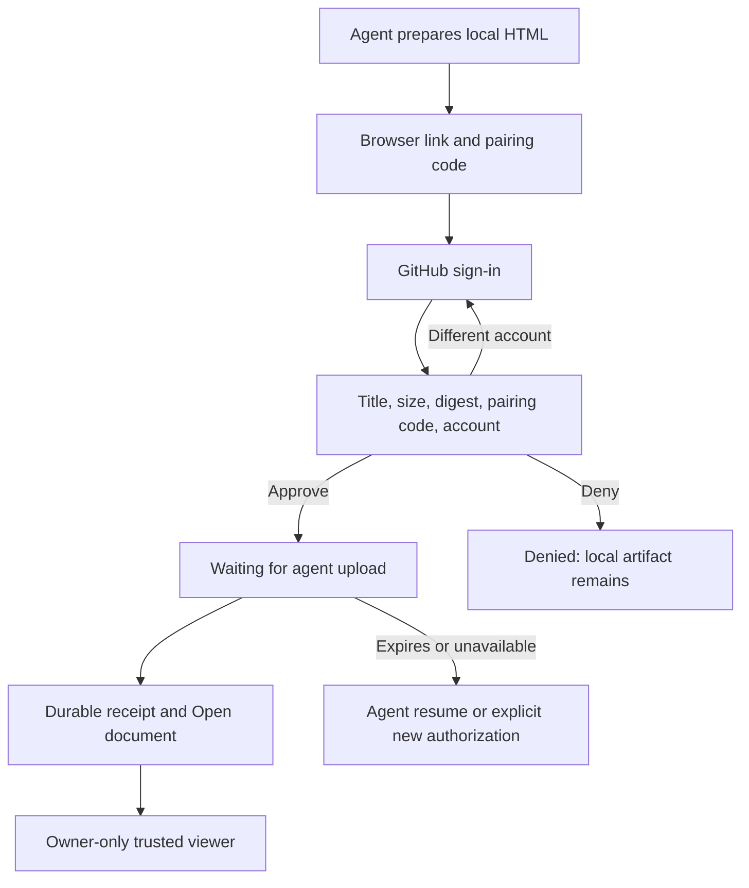

# Hosted owner publishing: design v1

DESIGN-001. Captured 2026-09-09 from the user's selected workflow and baseline Archon theme/navigation.
This is a versioned interaction design, not a screenshot of implemented UI. No external design export was supplied.
Product: private-first owner publication, GitHub identity only, no repository integration.

## Human and agent sequence

1. Agent builds local HTML and displays a local preview path. It confirms that selected content may be sent to the chosen Archon host; it must not assume employer permission.
2. Agent reports the publishing title, service hostname, pairing code, browser link and resumable request-file path. A pending request is not a published document.
3. Browser opens trusted `/publish/authorize`; a first-party bootstrap removes fragment verification material before analytics or navigation, binds the operation and shows Sign in with GitHub.
4. After login the approval page displays escaped title, size, digest prefix, pairing code and current GitHub account. Actions: Approve upload, Deny, or Use another account. The last action revokes the Archon session by protected POST and restarts GitHub OAuth with `prompt=select_account` while preserving pending browser binding; Archon logout alone does not log out GitHub. No implicit approval on login callback.
5. Approve enters a pending-upload state: "Upload approved. Return to your agent to finish." Polling for completion may update this page but cannot itself upload bytes.
6. Agent resumes and submits unchanged bytes. Only durable completion produces the final document URL. Browser offers Open document after observing completion.
7. Trusted viewer shows title, current owner login and Sign out above a separately labelled document frame. Loading and renderer failure stay in the trusted chrome, outside authored HTML.

## Required states and copy

| Surface | State | Visible behavior and permitted action |
| --- | --- | --- |
| Agent | Local invalid/oversize | Name safe validation reason and local path; do not start auth |
| Agent | Pending/checkpoint | Browser link, code and next command; no fake document URL |
| Approval | Signed out | Sign-in action; do not disclose private pending metadata before auth |
| Approval | Ready | Exact descriptor and displayed account; explicit approve/deny |
| Approval | Account changed in another tab | Reject stale confirmation and refresh displayed account before another action |
| Approval | Denied/cancelled/expired | Distinct terminal explanation; local artifact remains; no automatic replacement upload |
| Approval | Service unavailable | Retry hint, no success styling; do not convert outage into denial |
| Approval | Approved | Return-to-agent guidance; status remains visible |
| Viewer | Loading | Named document region with busy state, not blank success |
| Viewer | Signed out | Safe sign-in return to document ID only |
| Viewer | Missing/other owner | Indistinguishable not-found page with no title, owner or content leak |
| Viewer | Storage/renderer unavailable | Retry action and visible error; never render a stale other document |
| Viewer | Complete | Actual artifact interaction inside opaque sandbox; account controls remain outside |
| Agent | Ambiguous completion | Preserve request state and retry same operation; never silently duplicate |
| Agent | Receipt expired | Offer Check publication at the pinned host's `/docs/<saved-publicationId>`; preserve expired state and make no success claim until owner verification; no automatic republish |

## Layout and accessibility

Reuse Archon's restrained document typography and light/dark tokens; no marketing hero or unrelated dashboard.
Approval is a single-column, max-width reading form, reducing to full-width with gutters on mobile.
Place upload descriptor before account confirmation, then primary approve and secondary deny actions.
All controls use native links/buttons, visible focus, descriptive labels and keyboard order following visual order.
Error summaries receive focus after failed submission; async status uses a polite live region without stealing focus.
Waiting state disables duplicate submission but exposes terminal outcome and sign-out.
Use at least 44px touch targets, no color-only state distinctions and a labelled artifact iframe.
Verify 320px and 1280px viewports, keyboard-only approval/denial, screen-reader labels and return focus after retry.
The artifact may contain misleading authored UI; trusted account actions are visually and structurally separate and never delegated by postMessage.

## Design ownership

AHU-007 owns approval/login interaction, AHU-009 owns trusted viewer, AHU-005 owns renderer frame behavior, AHU-006/AHU-010 own agent output/instructions.
AHU-012 verifies these together; AHU-013 captures actual deployed evidence.
