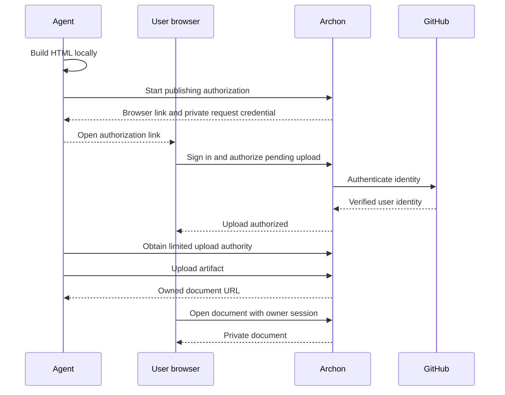
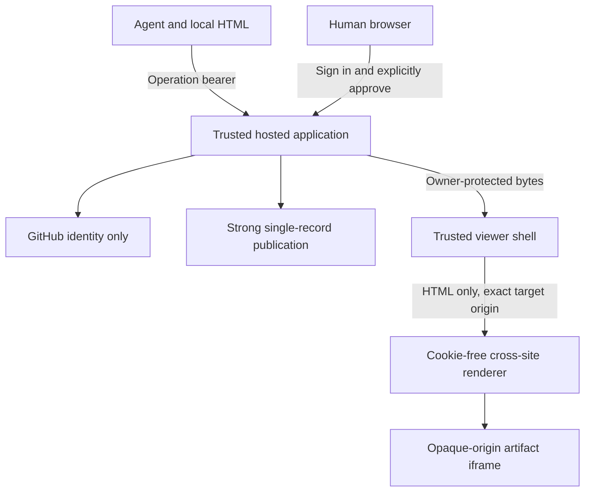

# Agent Hosted Upload - Plan

## Goal Capsule

- Objective: A user asks their coding agent to turn material into an Archon document, signs in with GitHub, and receives a hosted document they own.
- Product authority: The user selected agent-generated HTML plus browser sign-in and an agent upload endpoint as the first hosted experience.
- Scope assumption: The first slice ends at private upload and owner access; sharing and collaboration are deferred, not launch-blocking product questions.
- Execution profile: 13 Claude-owned work units in five dependency levels, with local producer tests and a separate real-hosted acceptance capstone.
- Authority: Operator decisions > product contract > researched contracts/design > GitHub promoted ticket truth > Aiur runtime state > baseline plan.
- Tail ownership: A later Aiur Executor owns promotion, implementation, review and release gates. This planning turn ends with the dashboard paused and zero implementation agents; it does not publish issues, push branches, deploy, or merge.
- Readiness: Work packets can execute after approval/promotion. Provider credentials and live-release gates remain explicit capstone prerequisites, not silently satisfied.

---

## Product Contract

### Summary

An agent prepares an Archon document locally and directs the user to an Archon authorization page.
After GitHub sign-in, the agent uploads the document using an Archon-issued credential and returns its private hosted URL.
The signed-in user becomes the document owner automatically.

### Problem Frame

Connecting a new application to an enterprise repository can require administrator approval even when the employee already has access.
The existing standalone publishing command also asks for a Netlify deployment and owner configuration.
The initial experience should require neither repository integration nor a hosting account from the document author.

### Key Decisions

- **Upload the artifact without connecting the repository.** GitHub-native comments and continuous repository synchronization are optional later integrations (session-settled: user-directed — chosen over mandatory repository integration: organization approval would block adoption).
- **GitHub supplies identity.** Sign-in requests only the information needed to identify the user, with no private repository, organization membership, or repository write permissions.
- **The agent handles publishing.** The user completes browser sign-in; the agent handles bundling and upload.
- **Ownership comes from authentication.** An upload cannot nominate an arbitrary owner by email, username, or request field.
- **Private first is the planning assumption.** A document URL alone does not grant access. Sharing and collaboration are not included in this Build Order.

### Actors

- A1. Author: the person asking for a document and signing in to own it.
- A2. Coding agent: prepares the artifact, initiates authorization, uploads, and reports the result.
- A3. Archon service: authenticates the author, authorizes the agent, stores the artifact, and enforces ownership.

### Key Flow

F1. Agent creation, explicit browser approval, durable upload and owner read:

1. The author says, "Turn this into an Archon doc."
2. The agent builds a portable HTML artifact locally and retains the local copy.
3. The agent starts an Archon publishing authorization request and presents a browser link.
4. The author opens that link, signs in with GitHub, and sees which pending upload they are authorizing.
5. The author explicitly approves the displayed upload under the displayed account. Archon binds that request to the account; the agent learns that authorization completed without receiving GitHub credentials or browser cookies.
6. The agent uploads the artifact to Archon using limited upload authority.
7. Archon stores the document under the authenticated owner and returns its hosted URL.
8. The author opens that URL while signed in and reads the document.

### Requirements

**Creation and publishing**

- R1. A supported agent can follow a distributable instruction or skill to produce and publish a document from the user's selected material.
- R2. The uploaded bundle is self-contained HTML with the assets needed to render it; the local artifact remains available after publishing.
- R3. The user needs no Netlify account, pasted personal access token, repository installation, or organization membership check.
- R4. Upload succeeds without a repository connection or repository credentials on Archon.
- R5. The agent returns a stable document URL only after durable creation succeeds.

**Authentication and ownership**

- R6. GitHub sign-in creates or retrieves an Archon account using stable provider identity rather than mutable username or email matching.
- R7. Browser authorization is bound to the agent's pending publishing request and clearly identifies the upload being authorized.
- R8. The agent receives limited, expiring Archon upload authority; it never receives the user's GitHub token or browser session.
- R9. The service assigns ownership from that authorization, ignoring or rejecting client-supplied ownership claims.
- R10. By default, only the owner can read the uploaded document, including its raw HTML and assets.
- R11. Rendering uploaded HTML cannot expose account credentials or grant access to other documents through the hosting origin.

**Recovery and limits**

- R12. Cancelled or expired authorization leaves the artifact local and gives the agent an actionable outcome.
- R13. Retrying an interrupted upload cannot create duplicate documents or change ownership for the same publishing operation.
- R14. Invalid or oversized bundles fail before publishing and leave no accessible partial document.
- R15. An unavailable authorization or storage service cannot produce a successful publication response.

### Acceptance Examples

- AE1. Given a new user and Claude following only the installed Archon skill with no GitHub credentials, the agent builds selected material into HTML, guides browser sign-in/approval and uploads a document owned by that user while retaining the local artifact. Covers R1-R9.
- AE2. Given a signed-out browser or a different signed-in account, opening the private document URL or directly requesting metadata/raw HTML reveals no document content or title; no separate public asset path exists in the single-file format. Covers R10.
- AE3. Given an upload request naming someone else as owner, the service cannot create a document owned by that other person. Covers R9.
- AE4. Given expired authorization, the agent cannot upload until authorization is renewed; the local HTML remains usable. Covers R8, R12.
- AE5. Given an upload whose response was lost, retrying yields the same document outcome rather than a second document. Covers R5, R13.
- AE6. Given HTML attempting to inspect the parent account page or call account APIs, rendering does not grant it the owner's account authority. Covers R11.
- AE7. Given a rejected upload or storage failure, no partial document is readable and the agent reports failure. Covers R14-R15.

### Scope Boundaries

Mandatory GitHub repository access, GitHub-native comments, automated source synchronization, and customer-operated Netlify setup are outside this slice.
Sharing, comments, editing, repeat publishing to an existing URL, document listing, and deletion require explicit scope decisions; this contract does not silently include or permanently exclude them.
Existing self-hosted behavior should remain available.

### Dependencies and Assumptions

Archon operates the shared hosting service and stores the uploaded document content.
Identity-only GitHub sign-in avoids asking for organization repository access; it does not promise unrestricted use under every enterprise account or data-handling policy.
The host is trusted to handle the uploaded content; this is not end-to-end encrypted storage.
Arbitrary active HTML makes rendering isolation a prerequisite, not a later polish task.

### Outstanding Questions

Deferred product choices: sharing, collaboration, deletion, account-wide document lists and hard account quotas are outside this Build Order. They do not block private-upload implementation.
Planning resolves protocol, input size, isolation, store and topology below. External OAuth registration, two HTTPS sites and pilot budget acceptance are live-release gates, not questions delegated to an implementation worker.

### Grounding

- `templates/docbuild/package.json`: the portable document builder is packaged as `@aiur-team/docbuild`.
- `scripts/connect.mjs`: current publishing accepts a local HTML file and manifest, requires an owner email, and operates a Netlify site.
- `netlify/functions/login.mjs`: current login is an email/password form backed by Netlify Identity.
- `netlify/lib/identity.mjs`: current principals are Netlify Identity users with an optional organization-email classification.
- `netlify/lib/access.mjs`: initial document ownership is seeded through `DOC_OWNERS`.
- `netlify/lib/store.mjs`: shared document state already uses Netlify Blobs with guarded writes.
- [GitHub OAuth scopes](https://docs.github.com/en/apps/oauth-apps/building-oauth-apps/scopes-for-oauth-apps): a no-scope token exposes public identity information without private repository permissions; checked 2026-09-09.
- [GitHub organization OAuth restrictions](https://docs.github.com/en/organizations/managing-oauth-access-to-your-organizations-data): personal account authorization is distinct from access to organization data; checked 2026-09-09.

---

## Planning Contract

### Key Technical Decisions

- DEC-001. Agent-produced single-file HTML, no repository integration. The user selected upload plus GitHub identity over required repository access; preserve local portability. (session-settled: user-directed — chosen over mandatory repository integration: organization approval would block adoption).
- DEC-002. Dedicated hosted GitHub OAuth and session seam. Published Netlify Identity does not establish stable GitHub-ID linkage; preserve its legacy users rather than migrate them.
- DEC-003. Single-record atomic publication in strong Blobs store. One CAS commits bytes and owner together; removes cross-record commit and cleanup races at the chosen 2MiB limit.
- DEC-004. Separate cookie-free renderer on another registrable site. Active HTML cannot execute on the account origin; exact-origin messaging plus an opaque nested sandbox protects credentials.
- DEC-005. Split-phase operation-scoped agent capability. Browser confirmation binds owner; bounded resume/status and 24-hour receipt recovery survive agent timeouts without leaking GitHub credentials.
- DEC-006. Private-first pilot with explicit live-release gates. No sharing was selected; defer hard quotas and unrestricted rollout while testing an operator-bounded pilot.
- DEC-007. Preserve self-hosted deployment and build profile. Root gate/connect/access stay unchanged; hosted output removes legacy remote/collaboration dependencies without redefining existing documents.

Exact proposed interfaces live in [contracts v1](../builds/agent-hosted-upload/contracts.md).
AHU-004 alone owns publication transitions and CAS; other handlers call its adapter.
All new modules are proposals until their producer lands.
GitHub credentials stay server-side and are discarded after identity lookup.
The host can read uploaded content: this is not end-to-end encrypted storage.

### Architecture

The sandbox protects account authority, not every self-navigation, content side channel or browser resource-exhaustion attack.
Accept arbitrary bounded self-contained HTML; the packaged builder is the recommended creation path.
No remote fetch service, archive extraction or server-side execution of uploaded code is introduced.
Optional UTF-8 BOM must round-trip so the owner's exact bytes hash to the approved digest.

### Current-to-target delta

| Concern | Current | Target |
| --- | --- | --- |
| Publish | `scripts/connect.mjs` operates a Netlify site and owner email | Shared agent upload endpoint |
| Identity | Netlify subject and email | GitHub numeric ID, opaque hosted session |
| Ownership | `DOC_OWNERS`, roles and org defaults | Immutable authenticated owner |
| Durability | Static deploy plus collaboration stores | One bounded HTML/owner record committed by CAS |
| Active HTML | Legacy gated generated site | Separate renderer plus opaque nested sandbox |
| Agent UX | Repo-local skill and connect script | Packaged instructions and resumable publisher |
| Abuse | Customer deployment context | Disabled-by-default pilot, ingress limits and budget gate |

Research: [authentication](../builds/agent-hosted-upload/research/authentication.md), [hosting/security](../builds/agent-hosted-upload/research/hosting-security.md), [repository/agent UX](../builds/agent-hosted-upload/research/repository-agent-ux.md).
These contain official sources, baseline code pointers, confidence and contradictions.
Netlify Identity is supported again; the published SDK/provider-linking gap, not deprecation, motivates the separate seam.
Blobs has no provider TTL or verified conditional deletion; do not ship a stale-listing cleanup worker or pretend CAS counters create a hard quota.
Production origin comparison uses pinned `tldts@7.4.12` with private suffixes enabled, not the last two hostname labels; [upstream API](https://github.com/remusao/tldts) and npm pin checked 2026-09-09.

### Scheduling

Waves have widths **2, 4, 5, 1, 1** and longest path five.
Critical spine: AHU-001 → AHU-004 → AHU-007 → AHU-012 → AHU-013; equal-length paths through identity, reader and operations exist.
Phase is a display hint; readiness follows merged dependencies, not a mandatory global barrier.
Prioritize AHU-001 then AHU-004/AHU-003 for fan-out.
AHU-011 follows AHU-004's landed start/status handlers and configures their rate rules without a competing edge layer. It does not wait for AHU-007/AHU-008/AHU-009.
Fixtures are allowed in tests only; no placeholder production approvals, bytes or receipts.
AHU-012 reconnects parallel producers using actual handlers and the installed CLI.
See [graph audit](../builds/agent-hosted-upload/graph-audit.md).

### External gates

- GATE-001: Operator authorizes promotion and implementation scope/review/merge policy. No implementation this turn.
- GATE-002: Operator supplies dedicated GitHub OAuth registration/callback/secret, two HTTPS sites on different registrable sites, isolated staging/prod, and two real test accounts.
- GATE-003: Operator accepts pilot traffic/budget envelope, physical-retention responsibility and disabled-by-default rollout. Ingress limits are best effort, not hard account/global quotas.
- GATE-004: Operator authorizes package/tarball release and synthetic live acceptance; local npm packing does not establish registry publication.

GATE-002–004 block live capstone completion, not local implementation.
No provider signup, DNS/secret change, spending, package publication or production rollout is authorized by this preparation request.
Deferred sharing/comments/editing/listing/deletion/hard quotas are not launch-blocking questions for this bounded slice.

---

## Implementation Units

Linked tickets are the full worker contracts. Existing pointers are researched at `dfbd7a7ed2bfb0b2f1742e1d1e2294ab599d1b79`; new paths are marked proposed in each ticket.

| Unit | Title | Primary files | Dependencies |
| --- | --- | --- | --- |
| U1 / AHU-001 | Establish hosted service boundaries and executable contracts | `hosted/package.json`, `hosted/netlify.toml` | None |
| U2 / AHU-002 | Build self-contained HTML for hosted rendering | `templates/docbuild/src/index.ts`, `templates/docbuild/src/cli.ts` | None |
| U3 / AHU-003 | Implement identity-only GitHub sign-in and browser sessions | `hosted/lib/identity.mjs`, `hosted/functions/auth-github-start.mjs` | AHU-001 |
| U4 / AHU-004 | Implement atomic publication state and capability storage | `hosted/lib/publication-store.mjs`, `hosted/lib/publications.mjs` | AHU-001 |
| U5 / AHU-005 | Render active HTML on an isolated static origin | `renderer/public/index.html`, `renderer/public/renderer.js` | AHU-001 |
| U6 / AHU-006 | Add resumable agent publishing commands | `templates/docbuild/src/publish-cli.ts`, `templates/docbuild/src/publish.ts` | AHU-001 |
| U7 / AHU-007 | Bind browser approval to the pending agent upload | `hosted/functions/publications-bind.mjs`, `hosted/functions/publications-review.mjs` | AHU-003, AHU-004 |
| U8 / AHU-008 | Commit approved artifact bytes atomically | `hosted/functions/publications-artifact.mjs`, `hosted/lib/artifact-body.mjs` | AHU-004 |
| U9 / AHU-009 | Serve private owner documents through the trusted viewer | `hosted/functions/documents.mjs`, `hosted/public/viewer/` | AHU-003, AHU-004, AHU-005 |
| U10 / AHU-010 | Distribute agent instructions and prove installed-package publishing | `skills/archon-doc/SKILL.md`, `templates/docbuild/scripts/pack-assets.mjs` | AHU-002, AHU-006 |
| U11 / AHU-011 | Prepare hosted deployment safeguards and operator runbook | `hosted/netlify.toml`, `renderer/netlify.toml` | AHU-004 |
| U12 / AHU-012 | Prove integrated browser and agent publishing security | `scripts/test-hosted-integration.mjs`, `scripts/fixtures/hosted/` | AHU-007, AHU-008, AHU-009, AHU-010, AHU-011 |
| U13 / AHU-013 | Prove the deployed owner-publishing experience | `docs/builds/agent-hosted-upload/live-acceptance.md`, `docs/builds/agent-hosted-upload/acceptance/` | AHU-012 |

### U1. Establish hosted service boundaries and executable contracts

- Goal: Deliver [AHU-001](../builds/agent-hosted-upload/tickets/AHU-001.md) as one reviewed outcome; complexity 3, phase 1.
- Requirements: R2, R3, R4, R6, R7, R8, R9, R10, R11, R14, R15; F1; contributes to AE1, AE2, AE3, AE6, AE7.
- Files: `hosted/package.json`, `hosted/netlify.toml`, `hosted/lib/contracts.mjs`, `hosted/lib/contracts.test.mjs`; ticket Surfaces owns the precise implementation boundary.
- Approach: Consume frozen contracts and named dependencies; ticket notes identify baseline patterns and new exports.
- Test scenarios: Execute the ticket's concrete success, invalid, denied, expired, unavailable and race cases.
- Verification: Ticket commands plus global gates below. Only U13 claims real-hosted acceptance.

### U2. Build self-contained HTML for hosted rendering

- Goal: Deliver [AHU-002](../builds/agent-hosted-upload/tickets/AHU-002.md) as one reviewed outcome; complexity 2, phase 1.
- Requirements: R1, R2, R11, R14; F1; contributes to AE1, AE6, AE7.
- Files: `templates/docbuild/src/index.ts`, `templates/docbuild/src/cli.ts`, `templates/base/layout.html`, `templates/docbuild/src/index.test.ts`; ticket Surfaces owns the precise implementation boundary.
- Approach: Consume frozen contracts and named dependencies; ticket notes identify baseline patterns and new exports.
- Test scenarios: Execute the ticket's concrete success, invalid, denied, expired, unavailable and race cases.
- Verification: Ticket commands plus global gates below. Only U13 claims real-hosted acceptance.

### U3. Implement identity-only GitHub sign-in and browser sessions

- Goal: Deliver [AHU-003](../builds/agent-hosted-upload/tickets/AHU-003.md) as one reviewed outcome; complexity 3, phase 2.
- Requirements: R3, R4, R6, R7, R8, R9, R10, R11, R15; F1; contributes to AE1, AE2, AE3, AE4, AE7.
- Files: `hosted/lib/identity.mjs`, `hosted/functions/auth-github-start.mjs`, `hosted/functions/auth-github-callback.mjs`, `hosted/functions/session.mjs`, `hosted/functions/auth-logout.mjs`; ticket Surfaces owns the precise implementation boundary.
- Approach: Consume frozen contracts and named dependencies; ticket notes identify baseline patterns and new exports.
- Test scenarios: Execute the ticket's concrete success, invalid, denied, expired, unavailable and race cases.
- Verification: Ticket commands plus global gates below. Only U13 claims real-hosted acceptance.

### U4. Implement atomic publication state and capability storage

- Goal: Deliver [AHU-004](../builds/agent-hosted-upload/tickets/AHU-004.md) as one reviewed outcome; complexity 3, phase 2.
- Requirements: R5, R7, R8, R9, R10, R12, R13, R14, R15; F1; contributes to AE1, AE3, AE4, AE5, AE7.
- Files: `hosted/lib/publication-store.mjs`, `hosted/lib/publications.mjs`, `hosted/functions/publications-start.mjs`, `hosted/functions/publications-status.mjs`, `hosted/functions/publications-cancel.mjs`; ticket Surfaces owns the precise implementation boundary.
- Approach: Consume frozen contracts and named dependencies; ticket notes identify baseline patterns and new exports.
- Test scenarios: Execute the ticket's concrete success, invalid, denied, expired, unavailable and race cases.
- Verification: Ticket commands plus global gates below. Only U13 claims real-hosted acceptance.

### U5. Render active HTML on an isolated static origin

- Goal: Deliver [AHU-005](../builds/agent-hosted-upload/tickets/AHU-005.md) as one reviewed outcome; complexity 3, phase 2.
- Requirements: R2, R10, R11, R14; F1; contributes to AE1, AE2, AE6.
- Files: `renderer/public/index.html`, `renderer/public/renderer.js`, `renderer/scripts/build.mjs`; ticket Surfaces owns the precise implementation boundary.
- Approach: Consume frozen contracts and named dependencies; ticket notes identify baseline patterns and new exports.
- Test scenarios: Execute the ticket's concrete success, invalid, denied, expired, unavailable and race cases.
- Verification: Ticket commands plus global gates below. Only U13 claims real-hosted acceptance.

### U6. Add resumable agent publishing commands

- Goal: Deliver [AHU-006](../builds/agent-hosted-upload/tickets/AHU-006.md) as one reviewed outcome; complexity 3, phase 2.
- Requirements: R1, R2, R3, R4, R5, R7, R8, R12, R13, R14, R15; F1; contributes to AE1, AE4, AE5, AE7.
- Files: `templates/docbuild/src/publish-cli.ts`, `templates/docbuild/src/publish.ts`, `templates/docbuild/package.json`; ticket Surfaces owns the precise implementation boundary.
- Approach: Consume frozen contracts and named dependencies; ticket notes identify baseline patterns and new exports.
- Test scenarios: Execute the ticket's concrete success, invalid, denied, expired, unavailable and race cases.
- Verification: Ticket commands plus global gates below. Only U13 claims real-hosted acceptance.

### U7. Bind browser approval to the pending agent upload

- Goal: Deliver [AHU-007](../builds/agent-hosted-upload/tickets/AHU-007.md) as one reviewed outcome; complexity 3, phase 3.
- Requirements: R3, R6, R7, R8, R9, R12, R15; F1; contributes to AE1, AE3, AE4, AE7.
- Files: `hosted/functions/publications-bind.mjs`, `hosted/functions/publications-review.mjs`, `hosted/functions/publications-decision.mjs`, `hosted/public/publish/`; ticket Surfaces owns the precise implementation boundary.
- Approach: Consume frozen contracts and named dependencies; ticket notes identify baseline patterns and new exports.
- Test scenarios: Execute the ticket's concrete success, invalid, denied, expired, unavailable and race cases.
- Verification: Ticket commands plus global gates below. Only U13 claims real-hosted acceptance.

### U8. Commit approved artifact bytes atomically

- Goal: Deliver [AHU-008](../builds/agent-hosted-upload/tickets/AHU-008.md) as one reviewed outcome; complexity 3, phase 3.
- Requirements: R2, R4, R5, R8, R9, R12, R13, R14, R15; F1; contributes to AE1, AE3, AE4, AE5, AE7.
- Files: `hosted/functions/publications-artifact.mjs`, `hosted/lib/artifact-body.mjs`; ticket Surfaces owns the precise implementation boundary.
- Approach: Consume frozen contracts and named dependencies; ticket notes identify baseline patterns and new exports.
- Test scenarios: Execute the ticket's concrete success, invalid, denied, expired, unavailable and race cases.
- Verification: Ticket commands plus global gates below. Only U13 claims real-hosted acceptance.

### U9. Serve private owner documents through the trusted viewer

- Goal: Deliver [AHU-009](../builds/agent-hosted-upload/tickets/AHU-009.md) as one reviewed outcome; complexity 3, phase 3.
- Requirements: R5, R6, R9, R10, R11, R15; F1; contributes to AE1, AE2, AE6, AE7.
- Files: `hosted/functions/documents.mjs`, `hosted/public/viewer/`; ticket Surfaces owns the precise implementation boundary.
- Approach: Consume frozen contracts and named dependencies; ticket notes identify baseline patterns and new exports.
- Test scenarios: Execute the ticket's concrete success, invalid, denied, expired, unavailable and race cases.
- Verification: Ticket commands plus global gates below. Only U13 claims real-hosted acceptance.

### U10. Distribute agent instructions and prove installed-package publishing

- Goal: Deliver [AHU-010](../builds/agent-hosted-upload/tickets/AHU-010.md) as one reviewed outcome; complexity 2, phase 3.
- Requirements: R1, R2, R3, R4, R5, R7, R8, R12, R13; F1; contributes to AE1, AE4, AE5.
- Files: `skills/archon-doc/SKILL.md`, `templates/docbuild/scripts/pack-assets.mjs`, `scripts/test-publish-package.mjs`; ticket Surfaces owns the precise implementation boundary.
- Approach: Consume frozen contracts and named dependencies; ticket notes identify baseline patterns and new exports.
- Test scenarios: Execute the ticket's concrete success, invalid, denied, expired, unavailable and race cases.
- Verification: Ticket commands plus global gates below. Only U13 claims real-hosted acceptance.

### U11. Prepare hosted deployment safeguards and operator runbook

- Goal: Deliver [AHU-011](../builds/agent-hosted-upload/tickets/AHU-011.md) as one reviewed outcome; complexity 2, phase 3.
- Requirements: R3, R4, R8, R10, R12, R14, R15; F1; contributes to AE4, AE7.
- Files: `hosted/netlify.toml`, `renderer/netlify.toml`, `hosted/OPERATIONS.md`, `scripts/test-hosted-operations.mjs`; ticket Surfaces owns the precise implementation boundary.
- Approach: Consume frozen contracts and named dependencies; ticket notes identify baseline patterns and new exports.
- Test scenarios: Execute the ticket's concrete success, invalid, denied, expired, unavailable and race cases.
- Verification: Ticket commands plus global gates below. Only U13 claims real-hosted acceptance.

### U12. Prove integrated browser and agent publishing security

- Goal: Deliver [AHU-012](../builds/agent-hosted-upload/tickets/AHU-012.md) as one reviewed outcome; complexity 3, phase 4.
- Requirements: R1, R2, R3, R4, R5, R6, R7, R8, R9, R10, R11, R12, R13, R14, R15; F1; contributes to AE1–AE7.
- Files: `scripts/test-hosted-integration.mjs`, `scripts/fixtures/hosted/`; ticket Surfaces owns the precise implementation boundary.
- Approach: Consume frozen contracts and named dependencies; ticket notes identify baseline patterns and new exports.
- Test scenarios: Execute the ticket's concrete success, invalid, denied, expired, unavailable and race cases.
- Verification: Ticket commands plus global gates below. Only U13 claims real-hosted acceptance.

### U13. Prove the deployed owner-publishing experience

- Goal: Deliver [AHU-013](../builds/agent-hosted-upload/tickets/AHU-013.md) as one reviewed outcome; complexity 2, phase 5.
- Requirements: R1, R2, R3, R4, R5, R6, R7, R8, R9, R10, R11, R12, R13, R14, R15; F1; contributes to AE1–AE7.
- Files: `docs/builds/agent-hosted-upload/live-acceptance.md`, `docs/builds/agent-hosted-upload/acceptance/`, `scripts/test-hosted-live.mjs`; ticket Surfaces owns the precise implementation boundary.
- Approach: Consume frozen contracts and named dependencies; ticket notes identify baseline patterns and new exports.
- Test scenarios: Execute the ticket's concrete success, invalid, denied, expired, unavailable and race cases.
- Verification: Ticket commands plus global gates below. Only U13 claims real-hosted acceptance.

---

## Verification Contract

This turn runs planning validators and inspects the paused dashboard, not product tests.
Future workers register every new test in actual CI commands in the producer PR.

| Gate | Command or proof | Result |
| --- | --- | --- |
| Public scrub | `scripts/scrub-check.sh` | No identities, credentials, private content or machine paths in tracked product/fixtures |
| Existing server imports | `npm ci --ignore-scripts --no-audit --no-fund`; `node scripts/check-function-modules.mjs` | Legacy deploy links before builder compilation |
| Builder | `npm --prefix templates/docbuild ci --no-audit --no-fund`; `npm --prefix templates/docbuild run check` | Builder and publishing client typecheck |
| Test inventory | `node scripts/check-test-inventory.mjs` | New tests explicitly execute in CI |
| Hosted imports, new AHU-001 gate | `npm --prefix hosted ci --ignore-scripts --no-audit --no-fund`; `node scripts/check-hosted-modules.mjs` | New deployment is self-contained without generated imports |
| Unit regressions | Literal Node commands in each ticket | Assert exact bytes, durable states, owner/capability boundaries and failures |
| Mutation proof | Isolated disposable worktree; remove guarded production condition, run named test, restore and rerun | Test fails without behavior and passes with it; record exact commands and clean-tree check |
| Installed client, new AHU-010 gate | `node scripts/test-publish-package.mjs` | Fresh tarball outside repo builds and invokes actual command/skill |
| Integration, AHU-012 plus AHU-009 producer gate | `node scripts/test-hosted-integration.mjs`; `node scripts/test-hosted-owner-viewer.mjs` | Actual producers, upstream provider fixture, browser/CLI and hostile artifact tests |
| Live acceptance | AHU-013 operator-authorized runner/browser walkthrough | Real GitHub, provider CAS/headers, two accounts, durable redeploy and retry |

Preserve all additional root CI regression runners.
Browser proof drives an actual artifact control, not just a shell/frame header.
Unavailable live credentials is an unmet gate, never mock success.
No quota, performance or cost saving is claimed.

---

## Definition of Done

All 13 ticket outcomes are merged under the later authorized review policy, current-base CI is green, and AHU-013 records real deployed AE1–AE7 evidence.
Distributed agent instructions and binary work outside the repository.
The owner can sign out/sign in and reopen the URL; different accounts cannot read any private bytes.
The local artifact remains after all terminal outcomes.
No production stub, abandoned alternative, secret, bypass, or unintended legacy self-hosting change remains.
Docs name configuration, limits, rollback/kill switch, rendering compatibility and enterprise/data-policy limitations.
Deferred work stays outside the finite Build Order.
This planning turn stops earlier: draft graph visible in the Archon dashboard, global provisioning paused, zero implementation agents.

---

## Appendix

- [Versioned design evidence](../builds/agent-hosted-upload/design-v1.md)
- [Contracts](../builds/agent-hosted-upload/contracts.md)
- [Graph audit](../builds/agent-hosted-upload/graph-audit.md)
- [Intake/authority](../builds/agent-hosted-upload/questions-or-commands.md)
- [Deferred findings](../builds/agent-hosted-upload/deferred-findings.md)
