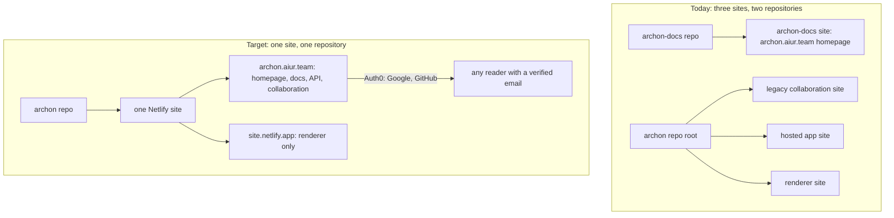
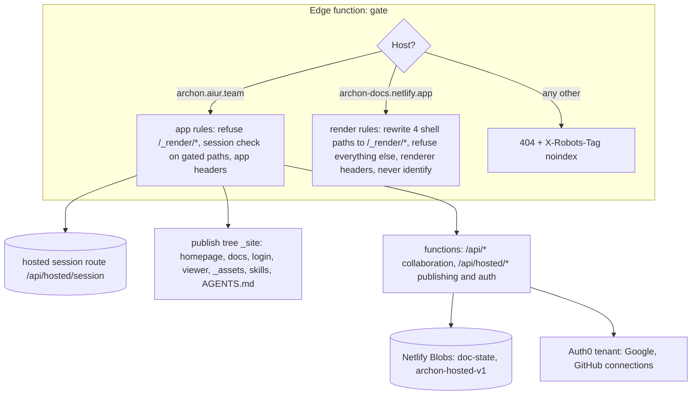

# Archon Consolidation - Plan

## Goal Capsule

- Objective: One repository and one Netlify site serve everything Archon does today across three deployments and two repositories, at `https://archon.aiur.team`, with one sign-in that non-engineers can use.
- Product authority: The operator chose the single-site topology, the one-Build-Order migration, Auth0 with Google and GitHub as the only sign-in, and per-document access by verified email domain.
- Scope assumption: The renderer keeps its own origin because the browser security model requires it; that origin is a second hostname of the same site, not a second site.
- Execution profile: 13 work units in six lanes and five dependency levels; local producer tests prove every unit, and a deployed acceptance capstone proves the two hostnames, the Auth0 round trip, and the domain gate on the live site.
- Authority: Operator decisions > Product Contract > Planning Contract > promoted ticket text > Aiur runtime state > this document's implementation notes.
- Stop conditions: stop and escalate if the site's `*.netlify.app` hostname starts redirecting to the custom domain, if Auth0 cannot deliver a verified email for a GitHub sign-in, or if any settled decision proves infeasible; otherwise complete every unit to its Definition of Done.
- Tail ownership: A later Aiur Executor owns promotion, implementation, review, deployment gates, and the archive-then-delete of the `archon-docs` repository. This planning turn publishes no issues and deploys nothing.

---

## Product Contract

### Summary

Merge the homepage, the collaboration layer, the hosted publishing application, and the renderer into the `archon` repository as one Netlify site behind `archon.aiur.team`.
Replace the two sign-in mechanisms with one Auth0-brokered sign-in offering Google and GitHub, and let a document owner open a document to everyone who signs in with a verified email at one or more chosen domains.
Retire the `archon-docs` repository once the single site serves its content.

### Problem Frame

Archon is deployed as three Netlify sites from two repositories: a static homepage from `archon-docs`, a legacy collaboration site from the `archon` root, and a hosted publishing application plus a renderer from `hosted/` and `renderer/` in the same repository.
Finishing the hosted rollout (Build Order #163) would have meant creating and wiring two more sites, two more DNS names, and their environment variables, and then keeping four deployments in step for one product.
Each site also has its own sign-in: the legacy site keeps an operator allowlist behind an edge gate, and the hosted application accepts GitHub identity only, which excludes the non-engineering readers an architecture document exists for.
The cost is operator setup that is duplicated per site, secrets that live in several places, tests that pin the multi-site shape, and a product that a reader cannot reach without a GitHub account.

### Key Decisions

- **One repository, one Netlify site, one hostname.** All user-facing surfaces live in `archon` and deploy as the `archon-docs` Netlify site (id `8b1cf43b-8f35-4034-ae71-aa6088862420`, already bound to `archon.aiur.team`); the other sites are never created (session-settled: user-directed — chosen over finishing the three-site setup first and reducing later: setting up three apps to then collapse them is wasted operator work).
- **The renderer is a second hostname of the same site.** Rendered artifacts are served from the site's `*.netlify.app` hostname, whose registrable site differs from `aiur.team`, so the existing origin-separation guarantee holds without a second site (session-settled: user-directed — chosen over a separate renderer site and over relaxing the same-site rule: a hostname costs nothing to operate and the isolation rule is a security property, not a convenience).
- **Everything migrates in one Build Order.** The collaboration layer, the hosted application, the renderer, and the homepage move together; there is no interim state with a partially consolidated site (session-settled: user-approved — proposed over a two-stage migration; the interim state would need its own routing and tests that are thrown away).
- **Auth0 brokers sign-in with Google and GitHub.** One sign-in serves the collaboration layer and the hosted application; the GitHub-only identity flow and the legacy allowlist login are replaced (session-settled: user-directed — chosen over keeping the hosted GitHub identity flow as the single sign-in: non-engineers must be able to read documents, and domain scoping needs a verified email).
- **Access by verified email domain is an owner-granted, per-document setting.** An owner may list one or more domains; any signed-in user whose identity carries a verified email at a listed domain can read the document (session-settled: user-directed — chosen over per-person invitations only: an architecture document is meant for a whole company, and inviting people one at a time does not scale).
- **Hosted routes stay where they are.** `/docs/<id>`, `/api/hosted/*`, and `/publish/authorize` keep their paths; the homepage stays at `/`; renderer content is reached only through the renderer hostname.
- **`archon-docs` is archived, then deleted last.** Its homepage, agent instructions, and redirects move into `archon`; the repository is archived once the single site serves them and deleted only after the operator confirms nothing links to it.



### Actors

- A1. Reader: a person, often not an engineer, who opens a document link and signs in with Google or GitHub.
- A2. Owner: the person who published a document and decides who may read it.
- A3. Coding agent: publishes documents through the existing authorize-and-upload flow.
- A4. Operator: runs the one Netlify site, the Auth0 tenant, DNS, and secrets.

### Key Flows

- F1. Company-wide read access
  - **Trigger:** An owner shares a document link with colleagues at `example.com`.
  - **Actors:** A2, A1
  - **Steps:** The owner adds `example.com` to the document's allowed domains. A colleague opens the link, is asked to sign in, chooses Google or GitHub, and returns to the document. Their verified email ends in `@example.com`, so the document opens.
  - **Outcome:** Everyone at the company can read; nobody outside it can, and nobody had to be invited by name.
  - **Covered by:** R9, R10, R11, R12
- F2. Agent publishing after consolidation
  - **Trigger:** A user tells their agent to turn an artifact into an Archon document.
  - **Actors:** A3, A2
  - **Steps:** The agent follows the served instructions, sends the user to `/publish/authorize`, the user signs in through Auth0, the agent uploads, and the owner receives `/docs/<id>`.
  - **Outcome:** The flow that Build Order #163 built works unchanged from the agent's point of view, on the single site.
  - **Covered by:** R1, R2, R5, R6, R7

### Requirements

**Topology and routing**

- R1. The `archon` repository deploys as exactly one Netlify site, and every surface below is served by that site: the homepage and agent instructions, the collaboration layer, the hosted publishing application, and the renderer.
- R2. `https://archon.aiur.team` serves the homepage at `/`, the hosted application at `/docs/<id>`, `/api/hosted/*`, and `/publish/authorize`, and the collaboration layer at the paths it uses today.
- R3. Rendered artifacts are served only from the site's `*.netlify.app` hostname, and the application hostname never serves artifact HTML as a first-party page.
- R4. The renderer hostname carries no session, reads no cookies, and is framed only by the application hostname, exactly as the current renderer contract requires.
- R5. The agent-facing files that `archon.aiur.team` serves today (`AGENTS.md`, `llms.txt`, and the skill file at `/skills/archon-doc/SKILL.md`) are served from the `archon` repository at the same paths, and the skill path is no longer a proxy to another repository.
- R6. The redirects `archon-docs` serves today (`/how-archon-works` and `/d/3c7f1a`) keep working after the move.
- R7. Environment configuration, secrets, and Netlify settings exist once, on the one site; nothing requires a second site to be created.
- R23. A request on any hostname other than the application hostname and the renderer hostname, such as a deploy preview, is refused with a not-found response that also tells crawlers not to index it.

**Sign-in**

- R8. Sign-in is one flow, brokered by Auth0, offering Google and GitHub, and it serves both the collaboration layer and the hosted application; the GitHub-only identity flow and the allowlist login form are removed.
- R22. Signing out ends the Archon session and the Auth0 session, so the next sign-in on the same browser shows the provider chooser again.
- R9. A signed-in identity carries a stable subject, a display name, an email, and whether that email is verified; Archon requests nothing beyond identity from either provider.
- R10. An owner is the identity that signed in during authorization, as today; no upload can nominate an owner.

**Per-document access**

- R11. An owner can set, view, and remove a list of one or more email domains on a document; on a collaboration document the existing per-person roles keep working alongside it, and a hosted document has an owner and domain readers only.
- R12. A signed-in user whose email is verified and whose domain exactly matches a listed domain can read the document; a user whose email is unverified, or at an unlisted domain, is refused with a message that names sign-in, not the document.
- R13. Domain matching is exact and case-insensitive on the full domain; a listed `example.com` does not admit `mail.example.com` or `example.com.evil.net`.
- R14. A document with no listed domains behaves as it does today: the owner, and on a collaboration document the individually granted people, can read it; nobody else can.
- R20. A public-mailbox domain such as `gmail.com` is refused when an owner tries to list it, with a message naming the reason, unless the operator has enabled public-mailbox domains site-wide.
- R21. Access by domain is evaluated on every request from the signed-in identity's current verified email; no per-person grant is stored when a domain admits someone, so a changed or removed email changes access at once.

**Documentation and operations**

- R15. `README.md` ends with a concise "Hosting" section that lists the steps to run the one site: create the site, bind the hostname, create the Auth0 application with the two connections, set the environment variables, and deploy.
- R16. The operations runbook and the renderer documentation describe the single-site topology and no longer instruct the operator to create separate sites.
- R17. Automated tests that today pin the two-site assumption pass against the consolidated shape without relaxing the registrable-site check.
- R18. The live acceptance procedure for the hosted flow targets the single site and the two hostnames, and its operator gates name only the resources that still exist.

**Retirement**

- R19. After the single site serves the homepage, `archon-docs` is archived with a note pointing at `archon`; it is deleted only after the operator confirms.

### Acceptance Examples

- AE1. Domain admits a verified colleague
  - **Covers R12, R13.**
  - **Given** a document lists `example.com`
  - **When** a user signs in with a verified `ann@example.com`
  - **Then** the document opens.
- AE2. Unverified email is refused
  - **Covers R12.**
  - **Given** a document lists `example.com`
  - **When** a user signs in with `ann@example.com` whose provider reports the email unverified
  - **Then** the document is refused and the message asks the user to verify their email with the provider.
- AE3. Subdomain and look-alike are refused
  - **Covers R13.**
  - **Given** a document lists `example.com`
  - **When** a user signs in with a verified `bob@mail.example.com` or `bob@example.com.evil.net`
  - **Then** the document is refused.
- AE4. Owner without domains keeps private behaviour
  - **Covers R14.**
  - **Given** a document lists no domains
  - **When** a signed-in user who is not the owner and holds no role opens the link
  - **Then** the document is refused, as today.
- AE5. Renderer never answers on the application hostname
  - **Covers R3, R4.**
  - **Given** a published document
  - **When** its artifact path is requested on `archon.aiur.team`
  - **Then** no artifact HTML is served; the same path on the `*.netlify.app` hostname serves it with the frame-ancestors header naming `https://archon.aiur.team`.

- AE6. Public-mailbox domain refused at write time
  - **Covers R20.**
  - **Given** the operator has not enabled public-mailbox domains
  - **When** an owner tries to list `gmail.com`
  - **Then** the list is unchanged and the response names `gmail.com` as a public mailbox provider.
- AE7. Sign-out reaches the identity broker
  - **Covers R22.**
  - **Given** a signed-in reader
  - **When** they sign out and immediately choose sign in again
  - **Then** the provider chooser is shown rather than a silent re-entry as the same identity.

### Scope Boundaries

- Not changing what a document is, how it builds, or the agent package published as `@aiur-team/archon`.
- Not adding SAML, enterprise SSO, or organisation-level admin beyond per-document domain lists.
- Not migrating existing data: neither the hosted application nor the collaboration layer has a live deployment, so no publication, grant, or identity record moves.
- Not adding per-person roles or invitations to hosted documents; they keep owner plus domain readers.
- Not linking Auth0 identities: a person who signs in with Google and later with GitHub holds two identities, and ownership follows the identity that authorized the upload.
- Not redesigning the homepage; it moves as-is.

### Dependencies and Assumptions

- The operator creates the Auth0 tenant and application and enables the Google and GitHub connections; the plan can proceed with placeholder environment names and a documented gate.
- Netlify's free plan cannot scope environment variables per context; all values are site-wide and marked secret, as `ABLY_API_KEY` already is.
- The `archon-docs` Netlify site is reused as the one site because it already owns `archon.aiur.team`; its build settings change from static publish to the repository build.
- The current same-site refusal in the hosted configuration is kept as-is and is satisfied by the two hostnames.


### Sources

- Hosted topology and the registrable-site rule: `hosted/OPERATIONS.md`, `hosted/lib/config.mjs`, `hosted/lib/contracts.mjs`.
- Renderer isolation contract: `renderer/README.md`, `renderer/public/renderer.js`, `renderer/scripts/build.mjs`, `hosted/public/viewer.js`.
- Legacy collaboration routing and realtime: `netlify.toml`, `netlify/edge-functions/gate.ts`, `netlify/lib/realtime.mjs`.
- Tests that pin the two-site assumption: `hosted/test/contracts.test.mjs`, `scripts/test-hosted-operations.mjs`, `scripts/test-hosted-renderer.mjs`, `scripts/test-hosted-integration.mjs`, `scripts/test-hosted-live.mjs`.
- Prior live acceptance this retargets: `docs/builds/agent-hosted-upload/live-acceptance.md` and its `evidence/` directory.
- Deploy guards that pin today's three-deployment shape: `.github/workflows/check.yml` (the hosted TOML and edge-function assertions), `scripts/test-hosted-operations.mjs`, `scripts/check-hosted-modules.mjs`, `scripts/check-function-modules.mjs`, `scripts/vendor-netlify-lib.mjs`, `scripts/connect.mjs`.
- Site build: `templates/docbuild/src/site.ts` (rebuilds `_site` from scratch, generates the root index, `_redirects`, and non-production `_headers`).

---

## Planning Contract

Product Contract preservation: changed R11 and R14 (hosted documents have owner plus domain readers; per-person roles exist only on collaboration documents), added R20 to R23 and AE6 to AE7 from flow and threat analysis; every other R, A, F, and AE is unchanged.

### Key Technical Decisions

- **One `netlify.toml`, one publish tree, one functions directory.** The root build command stays `templates/build --site`; `templates/docbuild/src/site.ts` gains explicit copy steps for the hosted static tree, the homepage tree, the served agent files, and the renderer shell, because `_site` is deleted and rebuilt on every build. `hosted/netlify.toml` and `renderer/netlify.toml` are deleted and the CI assertions that pin them are rewritten (session-settled: user-directed — chosen over three sites: inherits the Product Contract decision "One repository, one Netlify site, one hostname").
- **The renderer shell lives under `/_render/` in the publish tree and is exposed only on the renderer hostname.** The application hostname refuses `/_render/*`; the renderer hostname rewrites `/`, `/renderer.js`, `/renderer.css`, and `/renderer-config.js` onto that prefix and refuses every other path. The renderer's URL stays `https://<site>.netlify.app/` so `renderer/public/renderer.js`'s refusal of query strings and fragments and `hosted/lib/documents.mjs`'s bare-origin frame source both hold (session-settled: user-directed — chosen over a separate renderer site: inherits "The renderer is a second hostname of the same site"; verified live on 2026-09-10 that `archon-docs.netlify.app` answers 200 and is not redirected to the custom domain).
- **A host-aware edge function is the single authority for hostname behaviour and security headers.** Netlify `_headers` and `[[headers]]` rules are path-only, so the existing `gate` edge function is rewritten to classify the request host first: application host, renderer host, or other. It applies the renderer header set (generated today by `renderer/scripts/build.mjs`) on renderer paths, `frame-ancestors 'none'` and `X-Frame-Options: DENY` on application pages, and a not-found plus `X-Robots-Tag: noindex` on any other host. The root `X-Frame-Options: SAMEORIGIN` and the hosted `default-src 'none'` `/*` rules are removed from TOML, because Netlify emits every matching rule and browsers enforce the intersection of CSP headers.
- **Hosted code moves under `netlify/` with unique function names.** `hosted/lib` becomes `netlify/lib/hosted`, `hosted/functions/<name>.mjs` becomes `netlify/functions/hosted-<name>.mjs`, `hosted/test` becomes `netlify/test/hosted`, and `tldts` joins the root manifest. This satisfies the deploy-tree self-containment rule enforced by `scripts/vendor-netlify-lib.mjs` and resolves the duplicate `session.mjs` and the two `../lib/identity.mjs` targets. `scripts/connect.mjs` keeps vendoring `netlify/` wholesale into self-hosted consumers; the hosted routes fail closed with a 503 when `HOSTED_APP_ORIGIN` is unset, so a consumer site is unaffected.
- **Auth0 replaces both sign-in systems, reusing the hosted OAuth transaction shape.** The server-side `state` record, the independent `__Host-archon_oauth` binding cookie hashed into it, PKCE S256, and the server-held destination all carry over from `hosted/lib/github-oauth.mjs`; only the authorization server changes. ID tokens are verified with `jose` (`createRemoteJWKSet` plus `jwtVerify` pinned to RS256, issuer, audience, and nonce); no Auth0 SDK is added. Scopes are `openid profile email`; no refresh token is requested because the Archon session is the durable session. Sign-out revokes the Archon session and redirects to Auth0's `/v2/logout` with an allowlisted `returnTo`; the switch-account path sends `prompt=login` (session-settled: user-directed — inherits "Auth0 brokers sign-in with Google and GitHub", chosen over the hosted GitHub identity flow).
- **One session for the whole site: the hosted opaque session.** The edge gate stops calling Netlify Identity and instead validates the `__Host-archon_session` cookie by an internal request to the hosted session route, which is outside the gate's path. `netlify/lib/identity.mjs` returns `{accountId, email, emailVerified, name}` from that session; `@netlify/identity`, the password login, and the password-setting invitation acceptance are removed. An invitation is accepted by signing in with the invited verified email.
- **Principal contract version 2.** `provider` is `"auth0"`, `providerUserId` is the Auth0 subject (`google-oauth2|…` or `github|…`), `accountId` is `a0_` plus the first 32 hex characters of SHA-256 of the subject, and the principal gains `email` (normalized, or null) and `emailVerified` (strict boolean). Ownership and grants key on `accountId`; domain access keys on `email`. Two providers with the same email are two identities; the plan documents this rather than linking accounts.
- **One domain evaluator for both document kinds.** `netlify/lib/hosted/domain-access.mjs` normalizes with the existing `normalizeEmail` in `netlify/lib/access.mjs` (ASCII only, lowercase, at least two DNS labels), takes the substring after the last `@`, and compares the full domain with strict equality; never a suffix match. Evaluation order everywhere: owner, then explicit grant or live invitation (collaboration documents only), then non-empty domain list with `emailVerified === true` and an exact match, then refuse without disclosing the document. The same table drives the write path and the read path.
- **Public-mailbox domains are refused at write time by default.** A maintained denylist (`gmail.com`, `googlemail.com`, `outlook.com`, `hotmail.com`, `live.com`, `yahoo.com`, `icloud.com`, `proton.me`, `pm.me`, `aol.com`, `mail.ru`, `qq.com`) is checked when an owner sets the list; `ARCHON_ALLOW_PUBLIC_MAIL_DOMAINS=true` lifts it site-wide. The list is a code constant, not per owner.
- **Domain lists live on the existing per-document records.** Collaboration documents store `allowedDomains` on the `access/<docId>/doc.json` record in the `doc-state` store and expose it through a new body variant of `/api/access`; hosted publications store it on the publication record and expose it through a new owner-only `/api/hosted/publications/:id/access` route. Adding the check inside `resolveRole` covers the edge gate and `/api/session` at once.
- **The `archon-docs` site becomes the one site.** Its Netlify site already owns `archon.aiur.team` and `archon-docs.netlify.app`; the operator switches its linked repository to `aiur-team/archon` and its build settings to the repository build. The homepage, `AGENTS.md`, `llms.txt`, and `how-archon-works/` move into the `archon` repository under `site/`; the document builder emits `/how-archon-works/` and the `/d/3c7f1a` redirect itself once the `doc.json` is present.

### High-Level Technical Design



```mermaid
sequenceDiagram
  participant Br as Browser
  participant G as Edge gate
  participant Au as auth start/callback
  participant A0 as Auth0
  participant V as viewer or gated page
  Br->>G: GET /docs/id (no session)
  G->>Br: 303 /login/?destination=/docs/id
  Br->>Au: POST start (destination validated, state record + binding cookie + PKCE)
  Au->>Br: 303 Auth0 /authorize
  Br->>A0: choose Google or GitHub
  A0->>Br: 303 /api/hosted/auth/callback?code&state
  Br->>Au: callback
  Au->>A0: POST /oauth/token (client secret in function env)
  Au->>Au: verify ID token, build principal v2, rotate session
  Au->>Br: Set-Cookie __Host-archon_session; 303 stored destination
  Br->>V: GET /docs/id
  V->>V: owner? grant? verified email domain listed? else refuse
```

Access decision, applied identically by `resolveRole` and the hosted document read:

```text
if principal.accountId == record.owner        -> allow
if collaboration doc and explicit grant/invite  -> that role
if record.allowedDomains non-empty
   and principal.emailVerified === true
   and domainOf(principal.email) in record.allowedDomains (exact) -> viewer
else                                            -> refuse (not_found / session_required)
```

### Implementation constraints

- Every function keeps declaring its route in `config.path`; the checkers read source, not TOML.
- No relative import under `netlify/` may resolve outside `netlify/`; the hosted tree moves rather than being referenced.
- All hosted cookies stay `__Host-` prefixed with no `Domain`; that is what keeps the renderer host cookie-free.
- The registrable-site refusal in `netlify/lib/hosted/config.mjs` is kept unchanged.
- Test inventory: every new `*.test.mjs` or `scripts/test-*.mjs` file must be named literally in `.github/workflows/check.yml`.
- Prose in tickets and docs must pass `scripts/scrub-check.sh`.

### Sequencing

Level 1: U3. Level 2: U1, U4. Level 3: U2, U5, U7, U10. Level 4: U6, U9, U11. Level 5: U8, U12. Level 6: U13. U1 and U3 both edit `netlify.toml` and `check.yml`, so U1 depends on U3 rather than running beside it.

---

## Implementation Units

| U-ID | Title | Key files | Depends on |
|---|---|---|---|
| U1 | Single-site build and merged deploy config | `netlify.toml`, `templates/docbuild/src/site.ts`, `renderer/scripts/build.mjs`, `.github/workflows/check.yml` | U3 |
| U2 | Host-aware edge gate | `netlify/edge-functions/gate.ts`, `netlify/edge-functions/host.ts` | U1 |
| U3 | Move hosted code under `netlify/` | `netlify/lib/hosted/*`, `netlify/functions/hosted-*.mjs`, `package.json`, checker scripts | none |
| U4 | Principal contract v2 | `netlify/lib/hosted/contracts.mjs`, fixtures | U3 |
| U5 | Auth0 sign-in, callback, sign-out | `netlify/lib/hosted/auth0-oidc.mjs`, `netlify/functions/hosted-auth-*.mjs`, `netlify/lib/hosted/config.mjs` | U4 |
| U6 | One session for the collaboration layer | `netlify/lib/identity.mjs`, `netlify/edge-functions/gate.ts`, `netlify/functions/{login,logout,session,accept}.mjs` | U2, U5 |
| U7 | Domain evaluator and hosted document access | `netlify/lib/hosted/domain-access.mjs`, `netlify/functions/hosted-publications-access.mjs`, `netlify/functions/hosted-document-*.mjs` | U4 |
| U8 | Domain lists on collaboration documents | `netlify/lib/access.mjs`, `netlify/functions/access.mjs` | U6, U7 |
| U9 | Owner controls and refusal pages | `hosted` viewer assets under `netlify/public`, `templates/base/*` access panel | U7, U8 |
| U10 | Homepage and agent files move in | `site/`, `templates/docbuild/src/site.ts` | U1 |
| U11 | Documentation and hosting guide | `README.md`, `hosted/OPERATIONS.md`, `renderer/README.md` | U5, U6 |
| U12 | Test retarget and live acceptance runner | `netlify/test/hosted/*`, `scripts/test-hosted-*.mjs`, `docs/builds/agent-hosted-upload/live-acceptance.md` | U2, U6, U7, U8 |
| U13 | Deployed acceptance and `archon-docs` retirement | operator gates, evidence file | U9, U10, U11, U12 |

### U1. Single-site build and merged deploy config

- **Goal:** One `netlify.toml` and one build produce a publish tree that holds the collaboration pages, the hosted static tree, the renderer shell under `/_render/`, and the served agent files.
- **Requirements:** R1, R2, R5, R7; F2.
- **Dependencies:** U3.
- **Files:** `netlify.toml`, `hosted/netlify.toml` (delete), `renderer/netlify.toml` (delete), `templates/docbuild/src/site.ts`, `renderer/scripts/build.mjs`, `scripts/test-hosted-operations.mjs`, `.github/workflows/check.yml`, `scripts/connect.mjs`, `scripts/connect.test.mjs`, `templates/docbuild/src/site.test.ts` (or the existing site test file).
- **Approach:** Keep `templates/build --site` as the build command and `_site` as the publish directory. In `site.ts`, after the generated pages, copy `netlify/public/` (the former `hosted/public`) into `_site/`, copy `skills/` and the root `AGENTS.md` and `llms.txt` into `_site/`, and invoke the renderer build with an output directory of `_site/_render/`. Extend the reserved top-level route set with `docs`, `publish`, `skills`, `_render`, `viewer.js`, `viewer.css`. Move the `/publish/authorize` rewrite into the generated `_redirects`. Delete the root `X-Frame-Options` and the hosted `/*` CSP from TOML; headers move to U2. Rewrite the three CI assertions that pin the old TOMLs to assert the merged shape (one edge function on `/*`, no `X-Frame-Options` header rule, no second TOML). Keep the connect manifest at four entries and update its test for the new function names.
- **Execution note:** This is packaging; prefer a byte-identical rebuild check and a publish-tree inventory test over unit coverage.
- **Patterns to follow:** `site.ts` copier used for `login/` and `invite/`; `renderer/scripts/build.mjs` exact-inventory assertions, now parameterized by output directory.
- **Test scenarios:**
  - Happy path: a site build emits `_site/_render/index.html`, `renderer.js`, `renderer.css`, `renderer-config.js`, `_site/skills/archon-doc/SKILL.md`, `_site/AGENTS.md`, `_site/llms.txt`, `_site/publish/authorize.html`, `_site/viewer.js`.
  - Edge: a document whose slug is `docs` or `_render` fails the build with the reserved-route error.
  - Error: renderer build with `HOSTED_APP_ORIGIN` equal to `HOSTED_RENDER_ORIGIN` still fails.
  - Integration: `scripts/check-test-inventory.mjs`, `scripts/vendor-netlify-lib.mjs`, and `templates/check-dist` pass on the merged tree; `_site/_render/` is byte-identical to a standalone renderer build.
- **Verification:** CI green on the merged config; a local `netlify build` produces one publish tree with no second site referenced anywhere in the repository.

### U2. Host-aware edge gate

- **Goal:** One edge function decides, per hostname, what is served, what is refused, and which security headers apply.
- **Requirements:** R3, R4, R23; AE5.
- **Dependencies:** U1.
- **Files:** `netlify/edge-functions/gate.ts`, `netlify/edge-functions/host.ts` (new: host classification, refusal matrix, header sets), `netlify/edge-functions/host.test.ts` (new), `netlify.toml` (`excludedPath` update), `scripts/test-hosted-renderer.mjs`.
- **Approach:** Read the hostname from the request URL. Application host: refuse `/_render/*` with 404; on gated paths run the session check; set `frame-ancestors 'none'` and `X-Frame-Options: DENY` on pages and the existing nosniff and referrer rules. Renderer host: rewrite exactly `/`, `/renderer.js`, `/renderer.css`, `/renderer-config.js` to `/_render/…` by internal rewrite (URL unchanged), apply the renderer header set ported from `renderer/scripts/build.mjs` (CSP with `frame-ancestors https://archon.aiur.team`, `Referrer-Policy: no-referrer`, `Permissions-Policy`, `Cross-Origin-Resource-Policy: cross-origin`, no `X-Frame-Options`), 404 every other path with no body and no `Set-Cookie`, and never call the session check. Any other host: 404 with `X-Robots-Tag: noindex`. Hostnames come from `HOSTED_APP_ORIGIN` and `HOSTED_RENDER_ORIGIN`. Widen `excludedPath` to `/api/*` and `/_assets/*` only; `/login/*`, `/docs/*`, `/publish/*`, and `/invite/*` are handled inside the gate as ungated application paths so the host branch still runs on them.
- **Patterns to follow:** existing `gate.ts` structure; renderer header list in `renderer/scripts/build.mjs`.
- **Test scenarios:**
  - Happy path: on the renderer host `/` returns the renderer index with the renderer CSP and no `X-Frame-Options`; on the application host `/docs/<id>` reaches the viewer.
  - Edge: on the renderer host `/?x=1` is not rewritten (the shell refuses queries) and returns 404; `/_render/index.html` on the application host returns 404.
  - Error: on the renderer host `/api/hosted/session`, `/docs/<id>`, `/login/`, `/api/session`, `/<slug>/` return 404 with no `Set-Cookie` and no session lookup. Covers AE5.
  - Error: a deploy-preview hostname returns 404 with `X-Robots-Tag: noindex` for `/`, `/docs/<id>`, and `/api/hosted/session`.
  - Integration: exactly one `Content-Security-Policy` header on every response of both hosts.
- **Verification:** the refusal matrix test passes for both hosts and a third host; `scripts/test-hosted-renderer.mjs` still proves the framed render.

### U3. Move hosted code under `netlify/`

- **Goal:** The hosted functions, libraries, and tests live inside the self-contained deploy tree with unique names and one lockfile.
- **Requirements:** R1, R7.
- **Dependencies:** none.
- **Files:** `hosted/lib/*` to `netlify/lib/hosted/*`, `hosted/functions/*.mjs` to `netlify/functions/hosted-*.mjs`, `hosted/test/*` to `netlify/test/hosted/*`, `hosted/public/*` to `netlify/public/*`, `hosted/package.json` and lockfile (delete), `package.json`, `package-lock.json`, `scripts/check-hosted-modules.mjs`, `scripts/check-function-modules.mjs`, `scripts/vendor-netlify-lib.mjs`, `.github/workflows/check.yml`, `scripts/test-hosted-*.mjs` import paths.
- **Approach:** Mechanical move with `git mv`; rewrite relative imports; add `tldts` to the root manifest; fold the hosted module rules (`.mjs` only, no dynamic import, `/api/hosted/` route prefix with the `/docs/:documentId` page exception) into `check-function-modules.mjs` so one checker covers both trees; keep `hosted/OPERATIONS.md` in place for U11 to rewrite. Do not change behaviour.
- **Execution note:** Prove with the existing suites unchanged in content; a green run after the move is the evidence.
- **Patterns to follow:** existing checker structure in `scripts/check-function-modules.mjs`.
- **Test scenarios:**
  - Happy path: all former `hosted/test` suites and `scripts/test-hosted-*.mjs` pass from their new locations.
  - Error: a function under `netlify/functions` importing from outside `netlify/` fails `vendor-netlify-lib.mjs`.
  - Error: two functions declaring the same `config.path` fail the merged checker.
  - Integration: `scripts/check-test-inventory.mjs` finds every moved test named in CI.
- **Verification:** CI green with `hosted/functions` and `hosted/lib` gone and no duplicate function basenames.

### U4. Principal contract v2

- **Goal:** The hosted principal and session response carry an Auth0 subject, a normalized email, and a strict verified flag.
- **Requirements:** R9, R10.
- **Dependencies:** U3.
- **Files:** `netlify/lib/hosted/contracts.mjs`, `netlify/lib/hosted/publications.mjs`, `netlify/test/hosted/contracts.test.mjs`, `netlify/test/hosted/contract-fixtures.mjs`, `netlify/test/hosted/fixtures/auth.mjs`.
- **Approach:** Replace the `gh_` prefix and `"github.com"` provider with `"auth0"`, `providerUserId` as the raw subject (`^[a-z0-9-]+\|.+$`, max 256), `accountId` as `a0_` plus 32 hex of SHA-256 of the subject, `email` normalized or null, `emailVerified` boolean. Keep `requireExactKeys`. Extend the session response with `email` and `emailVerified`. `ownerAccountId` semantics are unchanged.
- **Test scenarios:**
  - Happy path: a Google subject and a GitHub subject validate and yield distinct `accountId` values.
  - Edge: same email on both subjects yields two principals; `email` null with `emailVerified` false validates.
  - Error: `emailVerified: "true"` (string) is rejected; a legacy `gh_` principal is rejected; an email in `providerUserId` position is rejected.
- **Verification:** contracts suite green; every fixture updated; no `gh_` literal remains under `netlify/`.

### U5. Auth0 sign-in, callback, sign-out

- **Goal:** Sign-in runs through Auth0 with the existing transaction guarantees, and sign-out ends both sessions.
- **Requirements:** R8, R22; F1, F2; AE7.
- **Dependencies:** U4.
- **Files:** `netlify/lib/hosted/auth0-oidc.mjs` (new, replaces `github-oauth.mjs`), `netlify/functions/hosted-auth-start.mjs`, `netlify/functions/hosted-auth-callback.mjs`, `netlify/functions/hosted-auth-logout.mjs`, `netlify/lib/hosted/config.mjs`, `netlify/lib/hosted/identity.mjs` (destination grammar), `netlify/public/login/index.html`, `netlify/public/login/login.js`, `package.json` (`jose`), `netlify/test/hosted/auth-routes.test.mjs`, `netlify/test/hosted/auth0-oidc.test.mjs` (new).
- **Approach:** Routes become `/api/hosted/auth/start`, `/api/hosted/auth/callback`, `/api/hosted/auth/logout`. Start: validate destination, create the state record with PKCE verifier and nonce, set the binding cookie, redirect to `https://<AUTH0_DOMAIN>/authorize` with `response_type=code`, `scope=openid profile email`, `state`, `nonce`, `code_challenge`, and `prompt=login` when switching accounts. Callback: constant-time state and binding check, exchange the code at `/oauth/token` with `client_secret_post`, verify the ID token with `jose` against the tenant JWKS, issuer, audience, RS256, and nonce, build the v2 principal (`email` only when the claim is present, `emailVerified` only when the claim is boolean true), revoke the old session, issue the new one, redirect to the stored destination. Logout: revoke, clear the cookie, redirect to `/v2/logout?client_id&returnTo=<HOSTED_APP_ORIGIN>/`. Config adds `AUTH0_DOMAIN`, `AUTH0_CLIENT_ID`, `AUTH0_CLIENT_SECRET` with the same redacted accessor as the GitHub secret. Destination grammar keeps `/publish/authorize` and `/docs/<32 hex>` and adds exactly `^/[a-z0-9-]{1,64}/$` for collaboration documents; the value stays server-side.
- **Patterns to follow:** `auth-github-start.mjs` and `auth-github-callback.mjs` transaction handling; `config.mjs` secret accessor; deterministic provider seam for tests.
- **Test scenarios:**
  - Happy path: full round trip with a fake token endpoint and a local JWKS yields a session whose response shows `email` and `emailVerified: true`.
  - Edge: `?error=access_denied` returns `status=denied` with the destination preserved; a GitHub token without an email claim yields a session with `email: null`.
  - Error: replayed `state` in a cookie-less browser returns `status=expired`; mismatched nonce, wrong audience, wrong issuer, or `alg: HS256` are rejected with no session; token endpoint 5xx returns `status=unavailable`.
  - Error: destinations `//evil.example`, `/\evil.example`, `/docs/%2e%2e/x`, `/api/login`, `/publish/authorize?next=x` are refused; `/how-archon-works/` is accepted.
  - Integration: logout response clears `__Host-archon_session` and redirects to the Auth0 logout URL with the exact `returnTo`. Covers AE7.
- **Verification:** auth suites green; grep of the publish tree and every function response for the client secret finds nothing.

### U6. One session for the collaboration layer

- **Goal:** The collaboration pages and APIs identify users through the hosted session, and the password login, Netlify Identity, and password invitations are gone.
- **Requirements:** R8, R11; F3.
- **Dependencies:** U2, U5.
- **Files:** `netlify/lib/identity.mjs`, `netlify/edge-functions/gate.ts`, `netlify/functions/login.mjs` (delete), `netlify/functions/logout.mjs` (delete), `netlify/functions/accept.mjs` (delete or reduce to sign-in redirect), `netlify/functions/session.mjs`, `netlify/lib/access.mjs` (identity keys), `login/` (delete root copy), `invite/index.html`, `package.json` (drop `@netlify/identity`), `netlify/test/identity.test.mjs` (new or existing), `netlify/functions/*.test.mjs` touched by identity.
- **Approach:** `identify()` returns `{sub: accountId, email, emailVerified, name}` by validating the `__Host-archon_session` cookie through the hosted session library; the edge gate does the same by an internal fetch of `/api/hosted/session` with the request cookie forwarded. Remove `isOrg` and `ORG_EMAIL_DOMAIN` (replaced by U8's per-document domains). Grants stay keyed by `sub`, now the v2 `accountId`; invitations stay keyed by hashed email and are satisfied by a signed-in identity whose verified email matches. The `/invite/` page becomes a sign-in prompt with the invitation token carried server-side.
- **Test scenarios:**
  - Happy path: a signed-in v2 principal reaches a gated document page; `/api/session` reports the resolved role.
  - Edge: an invited email signing in through Google with `emailVerified: true` resolves the invited role; the same email unverified resolves `none`.
  - Error: session store outage yields 503 from the gate, never a redirect to sign-in; a request with no cookie redirects to `/login/?destination=/<slug>/`.
  - Integration: `/api/login` and `/api/logout` no longer exist; no import of `@netlify/identity` remains.
- **Verification:** collaboration suites green; a manual local run shows one sign-in serving both a collaboration document and a hosted document.

### U7. Domain evaluator and hosted document access

- **Goal:** A hosted document owner can list domains, and readers with a verified email at a listed domain can open it.
- **Requirements:** R11, R12, R13, R14, R20, R21; F1; AE1 to AE4, AE6.
- **Dependencies:** U4.
- **Files:** `netlify/lib/hosted/domain-access.mjs` (new), `netlify/lib/hosted/domain-access.test.mjs` (new), `netlify/lib/hosted/contracts.mjs` (publication `allowedDomains`), `netlify/lib/hosted/publications.mjs`, `netlify/lib/hosted/publication-store.mjs`, `netlify/functions/hosted-publications-access.mjs` (new, `GET`/`PUT /api/hosted/publications/:publicationId/access`), `netlify/functions/hosted-document-read.mjs`, `netlify/functions/hosted-document-viewer.mjs`, `netlify/lib/hosted/documents.mjs` (refusal pages), `netlify/test/hosted/document-routes.test.mjs`, `netlify/test/hosted/publications.test.mjs`.
- **Approach:** `domain-access.mjs` exports `normalizeDomainList(list, {allowPublicMailboxes})`, `emailDomain(email)`, `isPublicMailbox(domain)`, and `evaluateAccess({record, principal, explicitRole})` implementing the fixed order. `allowedDomains` is an array of at most 20 normalized domains, empty by default, mutable only by the owner through the new route with exact origin, session, and CSRF. `readOwnedPublication` becomes `readAccessiblePublication`: owner or domain reader; refusals keep the non-disclosing `not_found` and `session_required` shapes, with a distinct `email_unverified` page text.
- **Execution note:** Implement the evaluator test-first from the AE table so the write path and read path share one fixture list.
- **Patterns to follow:** `normalizeEmail` in `netlify/lib/access.mjs`; route thunk and validator pattern in `hosted-publications-bind.mjs`.
- **Test scenarios:**
  - Happy path: `ann@example.com` verified admits; owner always admits even with `emailVerified: false`. Covers AE1.
  - Edge: `Bob@EXAMPLE.COM` admits; `a+b@example.com` admits; empty list refuses a non-owner. Covers AE4.
  - Error: `mail.example.com`, `example.com.evil.net`, `example.com.` (trailing dot), Cyrillic homoglyph, punycode, unverified email refuse. Covers AE2, AE3.
  - Error: `PUT` with `gmail.com` returns 400 naming the public mailbox; with `ARCHON_ALLOW_PUBLIC_MAIL_DOMAINS=true` it succeeds. Covers AE6.
  - Error: `PUT` from a non-owner returns `not_found`; without CSRF returns `csrf_failed`; 21 domains returns 400.
  - Integration: after `PUT`, `GET /docs/<id>` as a domain reader returns the viewer page and the artifact route serves bytes; after clearing the list the same reader gets `not_found`. Covers R21.
- **Verification:** evaluator and route suites green; the fixture list is imported by both write and read tests.

### U8. Domain lists on collaboration documents

- **Goal:** A collaboration document owner can list domains, and `resolveRole` admits verified readers at those domains as viewers.
- **Requirements:** R11, R12, R14, R20, R21.
- **Dependencies:** U6, U7.
- **Files:** `netlify/lib/access.mjs`, `netlify/functions/access.mjs`, `netlify/functions/access.test.mjs` (or existing access tests), `netlify/lib/access.test.mjs`.
- **Approach:** Add `allowedDomains` to the `access/<docId>/doc.json` record (bump `v`, default empty on read). Insert a step in `resolveRole` after invitation and before the public default that calls the shared evaluator and yields `viewer`. Add an owner-only `/api/access` body variant `{op: "domains", allowedDomains: [...]}` using the same normalizer and denylist. Remove `orgDefault` and the `ORG_EMAIL_DOMAIN` suffix rule.
- **Test scenarios:**
  - Happy path: verified `ann@example.com` on a document listing `example.com` resolves `viewer`; an explicit `editor` grant still wins.
  - Edge: a document with `PUBLIC_DEFAULT_ROLE=viewer` and no domains behaves as before.
  - Error: non-owner `domains` op returns 403; suffix match `mail.example.com` refuses.
  - Integration: the edge gate admits the domain reader to `/<slug>/` and `/api/session` reports `viewer`.
- **Verification:** access suites green; `ORG_EMAIL_DOMAIN` appears nowhere in `netlify/`.

### U9. Owner controls and refusal pages

- **Goal:** Owners can edit the domain list from the document page, and refused readers see the right message.
- **Requirements:** R11, R12; F1.
- **Dependencies:** U7, U8.
- **Files:** `netlify/public/viewer.js`, `netlify/public/viewer.css`, `netlify/lib/hosted/documents.mjs`, `templates/base/layout.html` and the enhance script under `templates/docbuild/src/` for the collaboration access panel, `scripts/test-hosted-owner-viewer.mjs`.
- **Approach:** In the hosted viewer, show an owner-only "Who can read" panel that reads and writes the access route with the session CSRF header; in the collaboration access panel add a domains field that posts the new `/api/access` op. Refusal pages: unverified email says "verify your email with your provider"; unlisted or unknown says "sign in with an account that has access" and never names the document.
- **Test scenarios:**
  - Happy path: owner adds `example.com`, panel shows it, reload persists.
  - Error: adding `gmail.com` shows the public-mailbox message inline; a non-owner never sees the panel and a forged request returns `not_found`.
  - Integration: browser run in `scripts/test-hosted-owner-viewer.mjs` covers add, remove, and refusal copy.
- **Verification:** owner-viewer browser suite green with the new steps.

### U10. Homepage and agent files move in

- **Goal:** The `archon` repository serves the homepage, `AGENTS.md`, `llms.txt`, the skill file, and `/how-archon-works/` from the one site.
- **Requirements:** R5, R6.
- **Dependencies:** U1.
- **Files:** `site/index.html`, `site/assets/*` (from the `archon-docs` repository), `AGENTS.md` (root, served), `llms.txt`, `how-archon-works/doc.json` and sections, `templates/docbuild/src/site.ts` (use the committed root index instead of the generated list page), `_site/_redirects` generation.
- **Approach:** Copy the `archon-docs` tree in; when `site/index.html` exists the builder copies it as the root index instead of rendering the list page. The `how-archon-works` document builds like any other and its `id` produces the `/d/3c7f1a` redirect. Drop the raw GitHub proxy; `/skills/archon-doc/SKILL.md` is a copied file that must stay byte-identical to `skills/archon-doc/SKILL.md`. Update `AGENTS.md` to instruct `npx @aiur-team/archon`.
- **Test scenarios:**
  - Happy path: the built tree has `/index.html` equal to `site/index.html`, `/how-archon-works/index.html`, and `_redirects` containing `/d/3c7f1a /how-archon-works/ 301`.
  - Edge: without `site/index.html` the generated list page is still produced.
  - Integration: `scripts/test-publish-package.mjs` byte-identical skill assertion still passes.
- **Verification:** site build green; `curl` of the four paths on a local `netlify serve` returns the expected files.

### U11. Documentation and hosting guide

- **Goal:** Operators can set up the one site from the README, and every runbook describes the single-site topology.
- **Requirements:** R15, R16.
- **Dependencies:** U5, U6.
- **Files:** `README.md`, `hosted/OPERATIONS.md`, `renderer/README.md`, `netlify/.env.example` (merged from `hosted/.env.example`), `docs/research/README.md` pointer.
- **Approach:** README ends with a "Hosting" section of at most twelve numbered steps: create or reuse the Netlify site, link the repository, confirm the `*.netlify.app` hostname serves, bind the custom domain, create the Auth0 application (Regular Web App) with Google and GitHub connections using your own provider apps and the `user:email` scope on GitHub, set callback and logout URLs, set the environment variables (`HOSTED_APP_ORIGIN`, `HOSTED_RENDER_ORIGIN`, `AUTH0_DOMAIN`, `AUTH0_CLIENT_ID`, `AUTH0_CLIENT_SECRET`, `ABLY_API_KEY`, `HOSTED_PUBLISH_ENABLED`) marked secret, deploy, run the live acceptance. OPERATIONS sections 1 to 3 describe one site and two hostnames; the renderer README explains the host-aware gate as the header authority.
- **Test scenarios:** Test expectation: none -- documentation; verified by review against the live setup in U13.
- **Verification:** every environment variable named in code is in the README table; no doc instructs creating a second site.

### U12. Test retarget and live acceptance runner

- **Goal:** The suites prove the single-site shape, and the live runner gates on the two hostnames and the Auth0 round trip.
- **Requirements:** R17, R18.
- **Dependencies:** U2, U6, U7, U8.
- **Files:** `netlify/test/hosted/contract-fixtures.mjs`, `netlify/test/hosted/contracts.test.mjs`, `scripts/test-hosted-integration.mjs`, `scripts/test-hosted-renderer.mjs`, `scripts/test-hosted-live.mjs`, `docs/builds/agent-hosted-upload/live-acceptance.md`, `.github/workflows/check.yml`.
- **Approach:** Fixtures use `https://archon.example.test` and `https://archon-example.netlify.app` shapes so the registrable-site check is exercised on the real pattern without relaxing `config.mjs`. The live runner gains: L0 the renderer hostname answers 200 and is not redirected; L0b a cookie set on the application host is absent from a renderer-host request; the host refusal matrix on both hosts; an Auth0 round trip with the operator's two test accounts (one Google, one GitHub); a domain-admit and domain-refuse pair. Live acceptance gates name only the one site, the Auth0 tenant, and the test accounts.
- **Test scenarios:**
  - Happy path: integration runner completes on loopback with the gate in front.
  - Error: the runner refuses to start when `HOSTED_LIVE_RENDER_ORIGIN` shares a registrable site with the app origin.
  - Integration: L0 fails loudly if the renderer host returns a 301.
- **Verification:** CI green; live runner prints every gate with the resource it waits on.

### U13. Deployed acceptance and `archon-docs` retirement

- **Goal:** The one site is live on both hostnames with Auth0, the live acceptance passes, and `archon-docs` is archived.
- **Requirements:** R1 to R23 on the deployed site; R19.
- **Dependencies:** U9, U10, U11, U12.
- **Files:** `docs/builds/agent-hosted-upload/evidence/consolidation-<date>-live-acceptance.md` (new), the `archon-docs` repository README (archive note).
- **Approach:** Operator gates: switch the Netlify site's repository to `aiur-team/archon` with the repository build settings; set the environment variables; create the Auth0 tenant, application, and both connections with own provider credentials; register callback and logout URLs; provide two test accounts. Then run `scripts/test-hosted-live.mjs`, record the evidence, archive `archon-docs` with a pointer, and delete it only after the operator confirms. Reopen the AHU-013 hold (#176) against this evidence.
- **Test scenarios:**
  - Happy path: every live gate passes and the evidence file lists the commit, hostnames, and account classes tested.
  - Error: any failed gate blocks the archive step.
- **Verification:** evidence file committed; `archon-docs` shows as archived; `archon.aiur.team/`, `/AGENTS.md`, `/skills/archon-doc/SKILL.md`, `/how-archon-works/`, and a hosted document all answer on the live site.

---

## Verification Contract

| Gate | Command | Applies to | Done signal |
|---|---|---|---|
| Scrub | `scripts/scrub-check.sh` | all | exit 0 |
| Typecheck and dist parity | `npm --prefix templates/docbuild run check` and `templates/check-dist` | U1, U10 | exit 0, no dist drift |
| Function modules | `node scripts/check-function-modules.mjs` | U3 to U8 | every function loads, routes unique |
| Self-contained deploy tree | `node scripts/vendor-netlify-lib.mjs` | U3 | no import escapes `netlify/` |
| Test inventory | `node scripts/check-test-inventory.mjs` | all units adding tests | every test named in CI |
| Hosted unit suites | `node --test netlify/test/hosted/*.test.mjs` | U4, U5, U7 | green |
| Collaboration suites | `node --test netlify/functions/*.test.mjs netlify/lib/*.test.mjs` | U6, U8 | green |
| Browser runners | `node scripts/test-hosted-renderer.mjs`, `node scripts/test-hosted-owner-viewer.mjs`, `node scripts/test-hosted-integration.mjs` | U2, U9, U12 | green |
| Full CI | `.github/workflows/check.yml` on the PR head | every PR | green on the exact head SHA |
| Live acceptance | `node scripts/test-hosted-live.mjs` with `HOSTED_LIVE_*` set | U13 | every gate passes on the deployed site |

---

## Definition of Done

- Every unit's test scenarios exist as tests and pass in CI on the merged main.
- No file under `hosted/functions`, `hosted/lib`, `hosted/netlify.toml`, or `renderer/netlify.toml` remains; `netlify.toml` is the only deploy configuration.
- `archon.aiur.team` and `archon-docs.netlify.app` behave per the refusal matrix on the live site, with evidence recorded.
- A Google sign-in and a GitHub sign-in each produce a session with a verified email on the live site, and a domain-admitted reader opens a hosted document and a collaboration document.
- README, OPERATIONS, and renderer docs describe one site; the README "Hosting" section is at the bottom and fits on one screen.
- `archon-docs` is archived; deletion waits for operator confirmation.
- Abandoned code from unsuccessful attempts is removed from the diff before each PR merges.
- #176 (AHU-013 hold) is resolved against the consolidation evidence instead of the two-site procedure.

---

## Risks and Dependencies

- **Operator gates on the critical tail:** Auth0 tenant and provider apps, Netlify repository switch, test accounts. U13 cannot start without them; every other unit can.
- **GitHub connection without `user:email`:** yields sessions with no email and silent domain refusals. U11 documents the scope; U12's live gate proves a GitHub sign-in carries a verified email.
- **Free-plan environment scoping:** the Auth0 client secret is visible to the build step. Mitigation: no build-time code reads it; it is marked secret.
- **Edge-gate internal session fetch adds a hop per gated page:** acceptable at pilot scale; if latency matters, the gate can read the session store directly through Netlify Blobs later.
- **`scripts/connect.mjs` consumers receive the hosted functions:** inert without `HOSTED_*` configuration; connect tests are updated in U1.

## Open Questions

Deferred to implementation:

- Whether the renderer-host rewrite is expressed as a domain-level `_redirects` rule or inside the edge function; U2 picks whichever the platform honours for the default subdomain and proves it with the refusal matrix.
- Whether the collaboration access panel lives in the enhance script or a separate module; U9 follows the existing panel's location.
