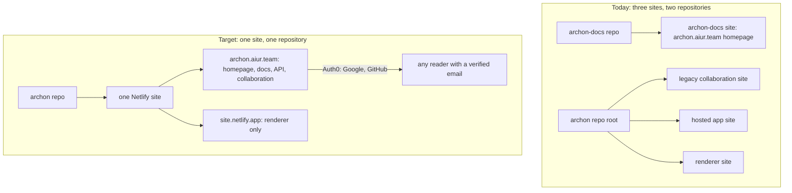

# Archon Consolidation - Plan

## Goal Capsule

- Objective: One repository and one Netlify site serve everything Archon does today across three deployments and two repositories, at `https://archon.aiur.team`, with one sign-in that non-engineers can use.
- Product authority: The operator chose the single-site topology, the one-Build-Order migration, Auth0 with Google and GitHub as the only sign-in, and per-document access by verified email domain.
- Scope assumption: The renderer keeps its own origin because the browser security model requires it; that origin is a second hostname of the same site, not a second site.
- Tail ownership: A later Aiur Executor owns promotion, implementation, review, deployment gates, and the archive-then-delete of the `archon-docs` repository. This planning turn publishes no issues and deploys nothing.

---

## Product Contract

### Summary

Merge the homepage, the collaboration layer, the hosted publishing application, and the renderer into the `archon` repository as one Netlify site behind `archon.aiur.team`.
Replace the two sign-in mechanisms with one Auth0-brokered sign-in offering Google and GitHub, and let a document owner open a document to everyone who signs in with a verified email at one or more chosen domains.
Retire the `archon-docs` repository once the single site serves its content.

### Problem Frame

Archon is deployed as three Netlify sites from two repositories: a static homepage from `archon-docs`, a legacy collaboration site from the `archon` root, and a hosted publishing application plus a renderer from `hosted/` and `renderer/` in the same repository.
Finishing the hosted rollout (Build Order #163) would have meant creating and wiring two more sites, two more DNS names, and their environment variables, and then keeping four deployments in step for one product.
Each site also has its own sign-in: the legacy site keeps an operator allowlist behind an edge gate, and the hosted application accepts GitHub identity only, which excludes the non-engineering readers an architecture document exists for.
The cost is operator setup that is duplicated per site, secrets that live in several places, tests that pin the multi-site shape, and a product that a reader cannot reach without a GitHub account.

### Key Decisions

- **One repository, one Netlify site, one hostname.** All user-facing surfaces live in `archon` and deploy as the `archon-docs` Netlify site (id `8b1cf43b-8f35-4034-ae71-aa6088862420`, already bound to `archon.aiur.team`); the other sites are never created (session-settled: user-directed — chosen over finishing the three-site setup first and reducing later: setting up three apps to then collapse them is wasted operator work).
- **The renderer is a second hostname of the same site.** Rendered artifacts are served from the site's `*.netlify.app` hostname, whose registrable site differs from `aiur.team`, so the existing origin-separation guarantee holds without a second site (session-settled: user-directed — chosen over a separate renderer site and over relaxing the same-site rule: a hostname costs nothing to operate and the isolation rule is a security property, not a convenience).
- **Everything migrates in one Build Order.** The collaboration layer, the hosted application, the renderer, and the homepage move together; there is no interim state with a partially consolidated site (session-settled: user-approved — proposed over a two-stage migration; the interim state would need its own routing and tests that are thrown away).
- **Auth0 brokers sign-in with Google and GitHub.** One sign-in serves the collaboration layer and the hosted application; the GitHub-only identity flow and the legacy allowlist login are replaced (session-settled: user-directed — chosen over keeping the hosted GitHub identity flow as the single sign-in: non-engineers must be able to read documents, and domain scoping needs a verified email).
- **Access by verified email domain is an owner-granted, per-document setting.** An owner may list one or more domains; any signed-in user whose identity carries a verified email at a listed domain can read the document (session-settled: user-directed — chosen over per-person invitations only: an architecture document is meant for a whole company, and inviting people one at a time does not scale).
- **Hosted routes stay where they are.** `/docs/<id>`, `/api/hosted/*`, and `/publish/authorize` keep their paths; the homepage stays at `/`; renderer content is reached only through the renderer hostname.
- **`archon-docs` is archived, then deleted last.** Its homepage, agent instructions, and redirects move into `archon`; the repository is archived once the single site serves them and deleted only after the operator confirms nothing links to it.

### Actors

- A1. Reader: a person, often not an engineer, who opens a document link and signs in with Google or GitHub.
- A2. Owner: the person who published a document and decides who may read it.
- A3. Coding agent: publishes documents through the existing authorize-and-upload flow.
- A4. Operator: runs the one Netlify site, the Auth0 tenant, DNS, and secrets.

### Key Flows

- F1. Company-wide read access
  - **Trigger:** An owner shares a document link with colleagues at `example.com`.
  - **Actors:** A2, A1
  - **Steps:** The owner adds `example.com` to the document's allowed domains. A colleague opens the link, is asked to sign in, chooses Google or GitHub, and returns to the document. Their verified email ends in `@example.com`, so the document opens.
  - **Outcome:** Everyone at the company can read; nobody outside it can, and nobody had to be invited by name.
  - **Covered by:** R9, R10, R11, R12
- F2. Agent publishing after consolidation
  - **Trigger:** A user tells their agent to turn an artifact into an Archon document.
  - **Actors:** A3, A2
  - **Steps:** The agent follows the served instructions, sends the user to `/publish/authorize`, the user signs in through Auth0, the agent uploads, and the owner receives `/docs/<id>`.
  - **Outcome:** The flow that Build Order #163 built works unchanged from the agent's point of view, on the single site.
  - **Covered by:** R1, R2, R5, R6, R7

### Requirements

**Topology and routing**

- R1. The `archon` repository deploys as exactly one Netlify site, and every surface below is served by that site: the homepage and agent instructions, the collaboration layer, the hosted publishing application, and the renderer.
- R2. `https://archon.aiur.team` serves the homepage at `/`, the hosted application at `/docs/<id>`, `/api/hosted/*`, and `/publish/authorize`, and the collaboration layer at the paths it uses today.
- R3. Rendered artifacts are served only from the site's `*.netlify.app` hostname, and the application hostname never serves artifact HTML as a first-party page.
- R4. The renderer hostname carries no session, reads no cookies, and is framed only by the application hostname, exactly as the current renderer contract requires.
- R5. The agent-facing files that `archon.aiur.team` serves today (`AGENTS.md`, `llms.txt`, and the skill file at `/skills/archon-doc/SKILL.md`) are served from the `archon` repository at the same paths, and the skill path is no longer a proxy to another repository.
- R6. The redirects `archon-docs` serves today (`/how-archon-works` and `/d/3c7f1a`) keep working after the move.
- R7. Environment configuration, secrets, and Netlify settings exist once, on the one site; nothing requires a second site to be created.

**Sign-in**

- R8. Sign-in is one flow, brokered by Auth0, offering Google and GitHub, and it serves both the collaboration layer and the hosted application; the GitHub-only identity flow and the allowlist login form are removed.
- R9. A signed-in identity carries a stable subject, a display name, an email, and whether that email is verified; Archon requests nothing beyond identity from either provider.
- R10. An owner is the identity that signed in during authorization, as today; no upload can nominate an owner.

**Per-document access**

- R11. An owner can set, view, and remove a list of one or more email domains on a document; the document's existing per-person roles keep working alongside it.
- R12. A signed-in user whose email is verified and whose domain exactly matches a listed domain can read the document; a user whose email is unverified, or at an unlisted domain, is refused with a message that names sign-in, not the document.
- R13. Domain matching is exact and case-insensitive on the full domain; a listed `example.com` does not admit `mail.example.com` or `example.com.evil.net`.
- R14. A document with no listed domains behaves as it does today: only the owner and individually granted people can read it.

**Documentation and operations**

- R15. `README.md` ends with a concise "Hosting" section that lists the steps to run the one site: create the site, bind the hostname, create the Auth0 application with the two connections, set the environment variables, and deploy.
- R16. The operations runbook and the renderer documentation describe the single-site topology and no longer instruct the operator to create separate sites.
- R17. Automated tests that today pin the two-site assumption pass against the consolidated shape without relaxing the registrable-site check.
- R18. The live acceptance procedure for the hosted flow targets the single site and the two hostnames, and its operator gates name only the resources that still exist.

**Retirement**

- R19. After the single site serves the homepage, `archon-docs` is archived with a note pointing at `archon`; it is deleted only after the operator confirms.

### Acceptance Examples

- AE1. Domain admits a verified colleague
  - **Covers R12, R13.**
  - **Given** a document lists `example.com`
  - **When** a user signs in with a verified `ann@example.com`
  - **Then** the document opens.
- AE2. Unverified email is refused
  - **Covers R12.**
  - **Given** a document lists `example.com`
  - **When** a user signs in with `ann@example.com` whose provider reports the email unverified
  - **Then** the document is refused and the message asks the user to verify their email with the provider.
- AE3. Subdomain and look-alike are refused
  - **Covers R13.**
  - **Given** a document lists `example.com`
  - **When** a user signs in with a verified `bob@mail.example.com` or `bob@example.com.evil.net`
  - **Then** the document is refused.
- AE4. Owner without domains keeps private behaviour
  - **Covers R14.**
  - **Given** a document lists no domains
  - **When** a signed-in user who is not the owner and holds no role opens the link
  - **Then** the document is refused, as today.
- AE5. Renderer never answers on the application hostname
  - **Covers R3, R4.**
  - **Given** a published document
  - **When** its artifact path is requested on `archon.aiur.team`
  - **Then** no artifact HTML is served; the same path on the `*.netlify.app` hostname serves it with the frame-ancestors header naming `https://archon.aiur.team`.

### Scope Boundaries

- Not changing what a document is, how it builds, or the agent package published as `@aiur-team/archon`.
- Not adding SAML, enterprise SSO, or organisation-level admin beyond per-document domain lists.
- Not migrating existing hosted publications: no hosted site has gone live, so there is no data to move.
- Not redesigning the homepage; it moves as-is.

### Dependencies and Assumptions

- The operator creates the Auth0 tenant and application and enables the Google and GitHub connections; the plan can proceed with placeholder environment names and a documented gate.
- Netlify's free plan cannot scope environment variables per context; all values are site-wide and marked secret, as `ABLY_API_KEY` already is.
- The `archon-docs` Netlify site is reused as the one site because it already owns `archon.aiur.team`; its build settings change from static publish to the repository build.
- The current same-site refusal in the hosted configuration is kept as-is and is satisfied by the two hostnames.

### Outstanding Questions

**Deferred to Planning**

- Where the `/login/*` path collision between the legacy edge gate and the hosted login page resolves once one sign-in replaces both.
- Whether the legacy edge gate's operator allowlist survives as a site-wide fallback or is replaced entirely by document roles plus domain lists.
- Which hostname the Netlify site's default `*.netlify.app` name resolves to today, and whether a second alias is needed for the renderer.

### Sources

- Hosted topology and the registrable-site rule: `hosted/OPERATIONS.md`, `hosted/lib/config.mjs`, `hosted/lib/contracts.mjs`.
- Renderer isolation contract: `renderer/README.md`, `renderer/public/renderer.js`, `renderer/scripts/build.mjs`, `hosted/public/viewer.js`.
- Legacy collaboration routing and realtime: `netlify.toml`, `netlify/edge-functions/gate.ts`, `netlify/lib/realtime.mjs`.
- Tests that pin the two-site assumption: `hosted/test/contracts.test.mjs`, `scripts/test-hosted-operations.mjs`, `scripts/test-hosted-renderer.mjs`, `scripts/test-hosted-integration.mjs`, `scripts/test-hosted-live.mjs`.
- Prior plan whose live acceptance this retargets: `docs/plans/2026-09-09-001-feat-agent-hosted-upload-plan.md` and `docs/builds/agent-hosted-upload/live-acceptance.md`.
